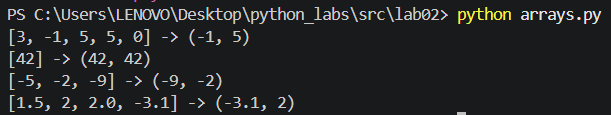
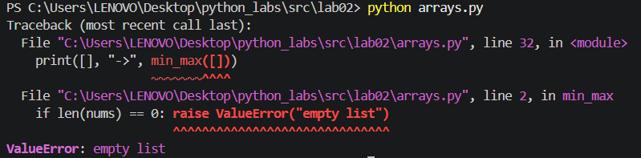
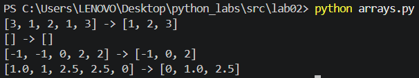
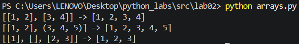
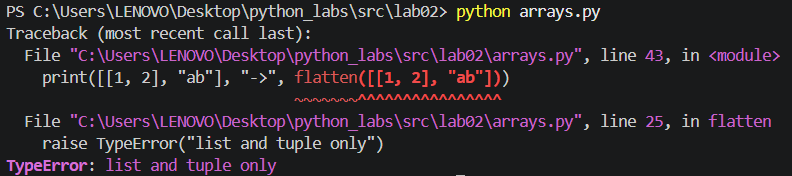
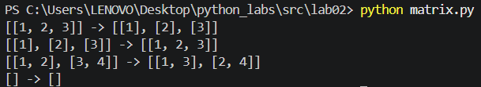
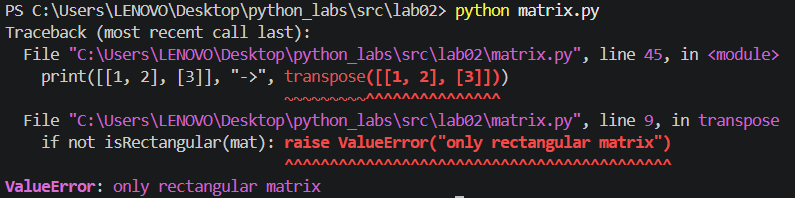
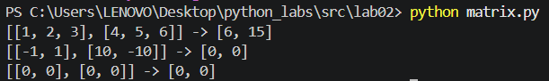
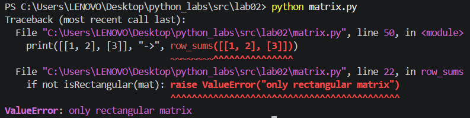
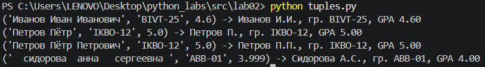

# ЛР2 — Коллекции и матрицы (list/tuple/set/dict)

## Задание 1 - `arrays.py`

Выполнение тест-кейсов:

### Функция `min_max`

### Функция `unique_sorted`

### Функция `flatten`

## Задание 2 - `matrix.py`

Выполнение тест-кейсов:

### Функция `transpose`

### Функция `row_sums`

### Функция `col_sums`

## Задание 3 - `tuples.py`

Выполнение тест-кейсов:

### Функция `format_record`
