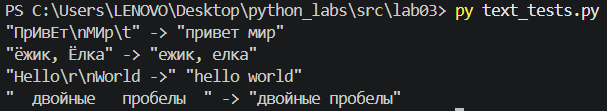
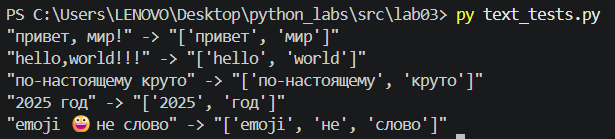
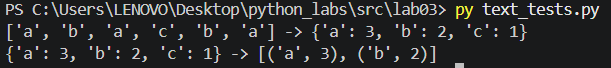
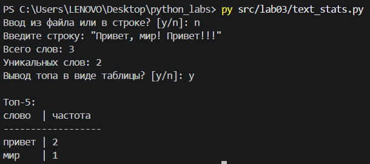

# Тексты и частоты слов (словарь/множество)

## Задание A - `src/lib/text.py`

Модуль `re` — это встроенная библиотека Python для работы с регулярными выражениями,
использовалась, чтоб решить задачи, которые стандартными методами строк красиво не сделать.
```py
import re
```

### Функция `normalize`

**Код:**
```py
def normalize(text: str, *, casefold: bool = True, yo2e: bool = True) -> str:
    if casefold: text = text.casefold()
    else: text = text.lower()

    if yo2e: text = text.replace('ё', 'е').replace('Ё', 'Е')

    text = re.sub(target := r'\s+', ' ', text)

    return text.strip()
```

Выполнение тест-кейсов:


### Функция `tokenize`

**Код:**
```py
def tokenize(text: str) -> list[str]:
    pattern = r'\w+(?:-\w+)*'
    return re.findall(pattern, text)
```
re.findall — извлекает все совпадения из текста и возвращает их в виде списка строк
\w+ — находит одну или более букв, цифр или символов подчёркивания;
(?:-\w+)* — это незапоминающая группа (?:...), которая ищет дефис, за которым сразу следует еще одна группа \w+. Знак * означает, что таких групп в слове может быть ноль или больше (например, для слов вроде кое-где-нибудь)

Выполнение тест-кейсов:


### Функции `count_freq` и `top_n`

**Код `count_freq`:**
```py
def count_freq(tokens: list[str]) -> dict[str, int]:
    freq = {}
    for token in tokens:
        if token in freq: freq[token] = freq[token] + 1
        else: freq[token] = 1

    return freq
```

**Код `top_n`:**
```py
def top_n(freq: dict[str, int], n: int = 5) -> list[tuple[str, int]]:
    lst = freq.items()
    
    sorted_items = sorted(lst, key=lambda x: (-x[1], x[0]))
    
    return sorted_items[:n]
```

freq.items() возвращает пары словаря в виде кортежей, т.е. dict[str, int] -> list[tuple[str, int]]

Выполнение тест-кейсов:


## Задание B - `src/lab03/text_stats.py`

Скрипт имеет возможность выбора способа ввода: через stdin или из файла. Если выбран первый способ, то читает одну строку текста из stdin, иначе - весь файл, к которому написан путь, целиком.

Реализован вывод в формате таблицы для топ-5 по частоте слов.

**Импорт функций из src/lib:**
```py
import sys
import os

sys.path.append(os.path.abspath("../lib"))

from text import *
```

**Выбор способа ввода:**
```py
inp = ""
while inp != 'y' and inp != 'n':
    inp = input('Ввод из файла или в строке? [y/n]: ').lower()

if inp == 'y':
    file_name = input('Введите полный путь к файлу: ')
    with open(file_name, 'r', encoding='utf-8') as f:
        st = f.read()

else: st = input('Введите строку: ')
```

Выполнение тест-кейсов:
